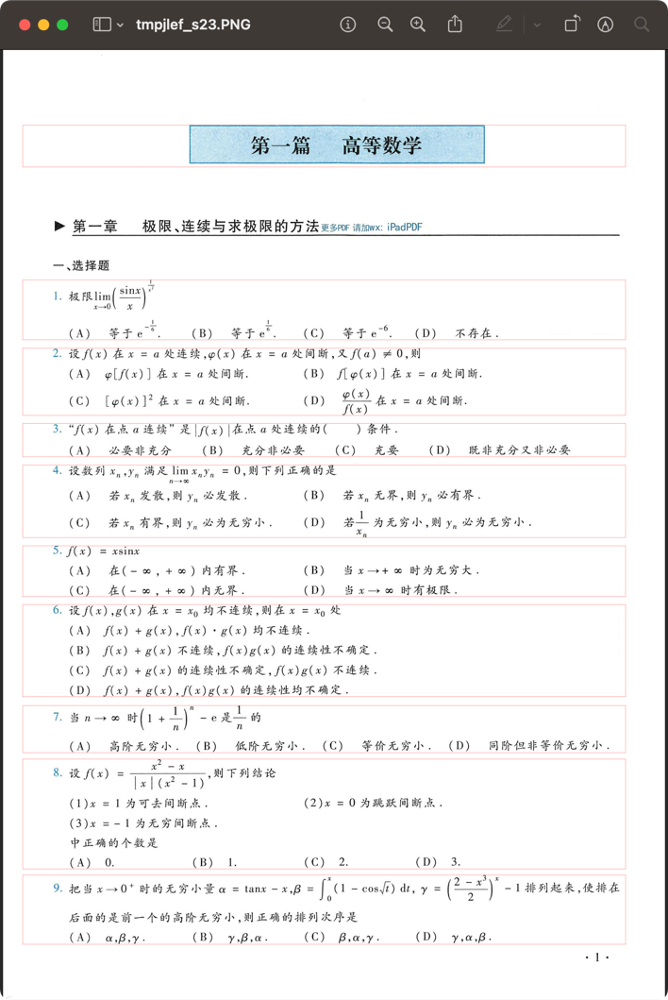

## TODO

- [ ] 没有绿色的标题
    - [ ] 第28张
- [ ] 【尝试特例处理，例如缩图重排或者单独解析】图片导致无法按照空白行解析
    - [ ] 第16张
    - [ ] 第19张
- [ ] 多列问题
    - [ ] 第6张
- [ ] 跨页问题
    - 第7张
- [ ] 【优先级降低】在提取内容时，需要增大上下margin，例如第23张第5题

### solved

- [x] 【尝试减小阈值】绿色的1无法解析
    - [x] 第24张
    - [x] 第32张
    - [x] 第36张（1、2、3）
- [x] 大标题没有正常排除
    - 【拒绝】解决方案一：参考第11张，所以可以归并到跨页问题内
    - 【接受】解决方案二：单独写一下排除大标题的逻辑，将其归为标题
    - [x] 第5张
    - [x] 第39张
- [x] block之间阈值
    - [x] 太小导致没把题目合并
        - [x] 第29张
    - [x] 【找不到问题了，不管了】太大导致没把题目区分开
        - [x] 第16张
        - [x] 第25张
    - [x] 【暂不处理，因为可以基于margin解决】需要基于聚类自动决定最合适的划分
        - [x] 第29张第8、10题
- [x] 【谨慎处理】block阈值不够小
    - [x] 第20张

## usage

```shell
# help
python main.py -h
```

### convert pdf to images

It's for saving time, and the pdf is too large (>100 MB), which would be refused by GitHub.

So the file would not be included in this repo on the cloud.

### (core) split problems from an image via pillow

```shell
python main.py split-problems data/images/5.jpg
```

result:


